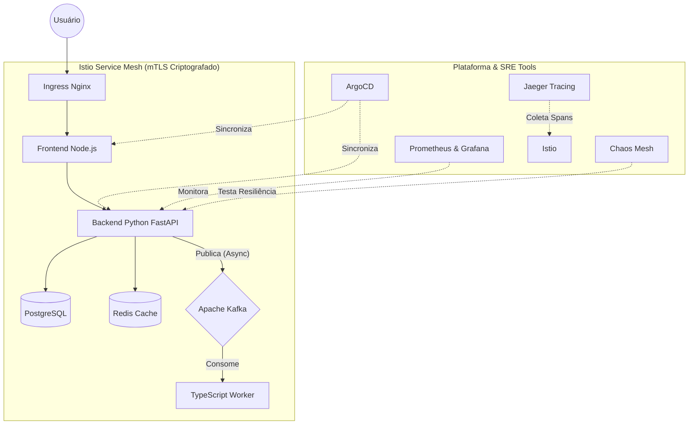

<div align="center">
  
  <h1>🚀 Ultimate Cloud-Native & SRE Architecture</h1>
  <p><strong>A Production-Grade, Event-Driven, Multi-Layered Security Kubernetes Platform</strong></p>

  <!-- Badges -->
  <p>
    
    
    
    
    
    
  </p>
</div>

---

## 📖 Visão Geral

Este projeto é uma **Masterclass de Arquitetura Cloud-Native e DevOps (Nível Sênior/SRE)**. Ele não é apenas uma aplicação rodando no Kubernetes; é uma verdadeira "Internal Developer Platform" simulada inteiramente em um cluster local utilizando o **Kind**.

O repositório foi construído com a premissa de adotar o **GitOps absoluto**, arquitetura orientada a eventos, **Zero-Trust Security** e resiliência militar com testes de engenharia do caos.

## 🏗️ Arquitetura do Sistema



---

## ⚡ Features de Elite Implementadas

### 🔒 Segurança em Múltiplas Camadas (Defense in Depth)
- **Zero-Trust Network Policies**: Tráfego bloqueado por padrão. Frontend só fala com Backend; Backend só fala com BD.
- **Kyverno Admission Controller**: Impossibilita subir pods rodando como root ou usando a tag `latest` em produção.
- **RBAC Estrito**: `ServiceAccounts` dedicados com permissão zero na API do Kubernetes para minimizar superfícies de ataque.
- **Pod Hardening**: Contêineres rodando como `non-root`, com `readOnlyRootFilesystem` ativo (arquivos imutáveis).

### 🚀 Event-Driven & Microsserviços
- **Python Backend (FastAPI)**: Integração assíncrona com PostgreSQL (`asyncpg`) e Redis, atirando eventos para o mensageiro instantaneamente.
- **TypeScript Worker**: Um microsserviço otimizado com Node.js compilado que consome tópicos do Kafka através da biblioteca `kafkajs`.
- **Apache Kafka (Strimzi)**: Orquestração nativa de tópicos e clusters via Custom Resources.

### 🔭 SRE & Observabilidade
- **Autoscaling Dinâmico (HPA)**: Se a CPU dos apps chegar a 70%, o cluster clona automaticamente as instâncias para suportar o tráfego.
- **Distributed Tracing (Jaeger)**: Rastros microscópicos pelo Service Mesh para identificar gargalos em milissegundos entre Python, TypeScript e Bancos de Dados.
- **Chaos Engineering (Chaos Mesh)**: Testes constantes executados em background que **matam Pods e inserem latência de rede** propositalmente, garantindo que o Auto-healing não é uma mentira.

---

## 📂 Estrutura do Repositório

```text
📦 project
 ┣ 📂 apps/                   # Código Fonte dos Microserviços
 ┃ ┣ 📂 backend/              # Python FastAPI (API e Kafka Producer)
 ┃ ┣ 📂 frontend/             # Node.js Express (Web UI)
 ┃ ┗ 📂 worker/               # TypeScript (Kafka Consumer)
 ┣ 📂 gitops/                 # "The Single Source of Truth"
 ┃ ┣ 📂 apps/                 # Manifestos K8s (Deployments, Services, HPA)
 ┃ ┣ 📂 argocd/               # Manifestos Application do ArgoCD (App of Apps)
 ┃ ┣ 📂 databases/            # StatefulSets puros de Postgres e Redis
 ┃ ┣ 📂 messaging/            # Strimzi Kafka CRDs
 ┃ ┗ 📂 security/             # NetworkPolicies, Kyverno, RBAC e Chaos Mesh
 ┣ 📂 infrastructure/         # Configuração base de IaC
 ┃ ┗ 📂 kind/                 # Definição do cluster multi-node
 ┣ 📜 Makefile                # Orquestrador local de Build/Deploy
 ┗ 📜 README.md               # Você está aqui
```

---

## 🛠️ Como Executar Localmente (Quickstart)

> **⚠️ Requisito de Hardware:** Todo esse ambiente (Istio, Kafka, Bancos, Monitoramento) é gigantesco. Recomenda-se no mínimo **8 a 12 GB de RAM livres** dedicados ao Docker para rodar sem travamentos.

**Dependências necessárias:**
- Docker
- [Kind](https://kind.sigs.k8s.io/)
- `kubectl`

### 1️⃣ Subindo o Canhão
Clone o repositório e rode o comando mestre na raiz do projeto:
```bash
make all
```
*O que esse comando faz? Ele vai compilar os 3 microsserviços do zero, subirá um cluster Kubernetes local, fará o sideload das imagens, instalará o Ingress Nginx e espetará o ArgoCD.*

### 2️⃣ A Mágica do GitOps
Para ver a infraestrutura nascendo sozinha, pegue a senha do ArgoCD:
```bash
kubectl -n argocd get secret argocd-initial-admin-secret -o jsonpath='{.data.password}' | base64 -d; echo
```
Faça o *port-forward* se quiser ver a UI:
```bash
kubectl port-forward svc/argocd-server -n argocd 8080:443
```
Acesse `https://localhost:8080` com o usuário `admin` e maravilhe-se com a árvore de dependências sincronizando os bancos, segurança e mensageria.

### 3️⃣ Acessando a Aplicação
Após o ArgoCD relatar que tudo está verde (Healthy/Synced), abra seu navegador no portal de entrada:
```text
http://localhost/
```

---

## 🛡️ Aviso de Segurança (Security Notice)
Este projeto é configurado nativamente com credenciais *dummy* (falsas) para facilitar os testes em ambientes locais (`kind`). 
> **Antes de realizar o deploy em Produção (EKS, GKE, AKS)**, altere a senha do arquivo `gitops/databases/postgres.yaml` e utilize soluções como **HashiCorp Vault** ou o **External Secrets Operator** integrado a KMS (Key Management Services).

<p align="center">
  Feito com ❤️, TypeScript e muita Engenharia de Confiabilidade!
</p>
