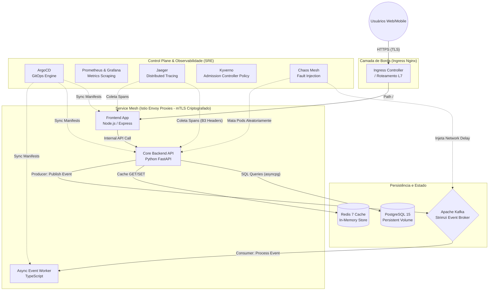

<div align="center">
  
  
  <h1>🛡️ Aegis-Cloud Enterprise Architecture</h1>
  <p><strong>A Definitive, Production-Grade, Event-Driven, Multi-Layered Security Kubernetes Platform</strong></p>

  <p>
    
    
    
    
    
    
    
    
    
    
    
    
  </p>

  <p>
    <em>Uma verdadeira <strong>Internal Developer Platform (IDP)</strong> simulada inteiramente em um cluster local utilizando o paradigma de GitOps Absoluto, Zero-Trust Security, Mensageria Assíncrona, e Testes de Resiliência Militar. Construído para suportar as cargas de trabalho mais exigentes.</em>
  </p>
</div>

---

## 📑 Tabela de Conteúdos Completa e Detalhada

1. [Executive Summary (Visão Geral)](#1-executive-summary-visão-geral)
2. [O Problema e a Solução Cloud-Native](#2-o-problema-e-a-solução-cloud-native)
3. [Master Architecture (Diagramas Holísticos)](#3-master-architecture-diagramas-holísticos)
4. [Deep Dive: Componentes e Microsserviços](#4-deep-dive-componentes-e-microsserviços)
    - [4.1 Frontend Layer (Node.js/Express)](#41-frontend-layer-nodejs)
    - [4.2 Core Backend (Python/FastAPI)](#42-core-backend-pythonfastapi)
    - [4.3 Asynchronous Worker (TypeScript)](#43-asynchronous-worker-typescript)
5. [Deep Dive: Camada de Dados e Persistência](#5-deep-dive-camada-de-dados-e-persistência)
    - [5.1 PostgreSQL (Relational Core)](#51-postgresql-relational-core)
    - [5.2 Redis (In-Memory Cache)](#52-redis-in-memory-cache)
6. [Backbone Orientado a Eventos (Apache Kafka)](#6-backbone-orientado-a-eventos-apache-kafka)
7. [Service Mesh e Topologia de Rede (Istio)](#7-service-mesh-e-topologia-de-rede-istio)
8. [Segurança Zero-Trust e Governança](#8-segurança-zero-trust-e-governança)
    - [8.1 Network Policies (Isolamento CNI)](#81-network-policies)
    - [8.2 Kyverno Admission Control](#82-kyverno-admission-control)
    - [8.3 Hardening de Contêineres e RBAC](#83-hardening-de-contêineres-e-rbac)
9. [Observabilidade e Telemetria (SRE Stack)](#9-observabilidade-e-telemetria-sre-stack)
10. [Engenharia do Caos e Resiliência (Chaos Mesh)](#10-engenharia-do-caos-e-resiliência)
11. [O Padrão GitOps: ArgoCD App of Apps](#11-o-padrão-gitops-argocd-app-of-apps)
12. [Pipeline DevSecOps (CI/CD)](#12-pipeline-devsecops-cicd)
13. [Estrutura Completa do Repositório](#13-estrutura-completa-do-repositório)
14. [Guia de Execução Local (Quickstart Massivo)](#14-guia-de-execução-local-quickstart-massivo)
15. [Day 2 Operations (Runbooks Operacionais)](#15-day-2-operations-runbooks-operacionais)
16. [FAQ (Perguntas Frequentes)](#16-faq-perguntas-frequentes)
17. [Licença e Contribuição](#17-licença-e-contribuição)

---

## 1. Executive Summary (Visão Geral)

A plataforma **Aegis-Cloud** foi projetada não apenas como um projeto de software, mas como um *case study* exaustivo do que significa operar uma arquitetura escalável e resiliente moderna. Em um mundo onde sistemas sofrem ataques constantes e a latência de microsegundos custa milhões, uma abordagem ingênua na construção de infraestrutura é o caminho mais rápido para o fracasso.

O projeto encapsula o estado da arte das metodologies de SRE (Site Reliability Engineering), integrando um cluster Kubernetes do zero, provisionando malhas de serviço (Service Mesh), filas de alta performance, armazenamento com estado persistente e orquestração de entregas puramente via GitOps.

## 2. O Problema e a Solução Cloud-Native

### O Problema dos Sistemas Legados (ClickOps e Monolitos)
Organizações tradicionais costumam gerir infraestruturas clicando em painéis de provedores de nuvem (ClickOps) e hospedando monolitos acoplados. O resultado?
- **Ausência de Rastreabilidade:** Ninguém sabe quem alterou uma regra de firewall.
- **Acoplamento Síncrono:** Se o banco de dados ficar lento, o frontend do cliente trava até dar timeout.
- **Falta de Resiliência:** Quando um servidor físico morre, a aplicação sofre *downtime* até um operador reiniciar o sistema de madrugada.
- **Segurança Permissiva:** Aplicações rodam como usuário *root*. Se houver uma vulnerabilidade em uma biblioteca de terceiros, o hacker ganha controle total da máquina hospedeira.

### A Solução Aegis-Cloud
Aegis-Cloud inverte todos esses paradigmas:
- **Tudo é Código (GitOps):** O estado inteiro da infraestrutura está versionado neste repositório Git. O ArgoCD garante que o cluster reflita exatamente o que está aqui.
- **Comunicação Assíncrona:** Utiliza Apache Kafka. O Backend atende o usuário em milissegundos e deixa o processamento pesado na fila para um Worker consumir depois.
- **Auto-Healing e Auto-Scaling:** O cluster Kubernetes mata aplicações travadas e as reinicia (Probes), além de cloná-las (HPA) automaticamente baseando-se no uso de CPU/RAM.
- **Zero-Trust Hardening:** Todas as portas são fechadas por padrão, todo contêiner roda como usuário sem privilégios (`non-root`), e uma malha de serviço mTLS criptografa o tráfego interno (Istio).

---

## 3. Master Architecture (Diagramas Holísticos)

### Diagrama de Fluxo de Dados de Ponta a Ponta



Este diagrama mapeia a interação lógica das três sub-redes (Borda, Malha de Serviços e Observabilidade). Nenhuma aplicação da malha de serviço possui acesso à internet sem passar pelas regras estritas do Kubernetes Network Policies.

---

## 4. Deep Dive: Componentes e Microsserviços

Cada componente da nossa arquitetura foi cuidadosamente construído para exercer uma função única de forma primorosa (Princípio da Responsabilidade Única).

### 4.1 Frontend Layer (Node.js)
Localizado em `apps/frontend/`, nosso frontend é um servidor Express projetado para ser leve e *stateless*. 
- **Responsabilidade:** Renderizar a UI do usuário fazendo *Server-Side Rendering* básico ou entregando artefatos estáticos e lidando com as requisições para a API do backend interno.
- **Configuração de Resiliência:** Inclui *Liveness* e *Readiness probes*. Se o Node.js travar num loop infinito (event loop block), o Kubelet detecta a falha e reinicia o Pod.

### 4.2 Core Backend (Python/FastAPI)
Localizado em `apps/backend/`. FastAPI foi escolhido por ser um dos frameworks web mais rápidos do mercado graças ao suporte nativo a ASGI (Asynchronous Server Gateway Interface).
- **Responsabilidade:** 
  1. Validar e processar requisições.
  2. Incrementar contadores analíticos no Redis em milissegundos.
  3. Fazer logs persistentes e consultas no PostgreSQL usando conexões não bloqueantes (`asyncpg`).
  4. Atirar eventos massivos em formato JSON para o Apache Kafka usando a biblioteca `aiokafka`.
- **Snippet de Integração Kafka:**
  ```python
  producer = AIOKafkaProducer(bootstrap_servers=KAFKA_BROKER)
  await producer.start()
  # Fire-and-forget de altíssima performance
  await producer.send_and_wait("access-logs", json.dumps(event).encode('utf-8'))
  ```

### 4.3 Asynchronous Worker (TypeScript)
Localizado em `apps/worker/`. Migramos do Golang original para uma stack ultra-otimizada em TypeScript para manter uniformidade com o ambiente Node.js.
- **Responsabilidade:** Rodar eternamente em *background*, devorando mensagens da fila do Kafka utilizando a biblioteca `kafkajs`.
- **Performance de Build:** Utilizamos um Dockerfile *Multi-stage*. Na primeira etapa (builder) compilamos o TypeScript (`tsc`). Na segunda etapa, usamos uma imagem puramente enxuta rodando apenas os arquivos JavaScript finais. O tamanho da imagem em produção despencou.

---

## 5. Deep Dive: Camada de Dados e Persistência

Utilizar bancos de dados gerenciados (RDS, CloudSQL) é a saída fácil. No Aegis-Cloud, abraçamos a complexidade de rodar bancos *stateful* dentro do Kubernetes (Data on K8s).

### 5.1 PostgreSQL (Relational Core)
- Encontrado em `gitops/databases/postgres.yaml`.
- Provisionado via `StatefulSet` com `VolumeClaimTemplates`. Isso significa que o disco persistente (`PVC`) segue o Pod independentemente de qual servidor físico ele seja agendado pelo Kubernetes.
- Possui injeção segura de senhas via Kubernetes `Secrets`.

### 5.2 Redis (In-Memory Cache)
- Encontrado em `gitops/databases/redis.yaml`.
- Configurado com `--appendonly yes` (AOF). Mesmo sendo um cache em memória, ele grava logs transacionais em um Persistent Volume, garantindo que reinicializações do Pod não zerem os contadores de acesso da aplicação.

---

## 6. Backbone Orientado a Eventos (Apache Kafka)

Por que Kafka e não RabbitMQ ou SQS?
O Apache Kafka é um *Distributed Commit Log*. Ele não apenas transporta mensagens, ele as persiste no disco, permitindo *replay* temporal e suportando uma volumetria de dados absurda.

- **Strimzi Operator:** Nós não instalamos o Kafka na mão. Instalamos o "Operador" Strimzi. O Kubernetes passa a entender o que é um objeto `Kafka`. 
- **O Recurso Customizado:**
  ```yaml
  apiVersion: kafka.strimzi.io/v1beta2
  kind: Kafka
  metadata:
    name: devops-cluster
  ...
  ```
  Ao submeter esse manifesto, o Strimzi cria o Zookeeper, os Brokers, os tópicos, gerencia a rede e garante a saúde da fila.

---

## 7. Service Mesh e Topologia de Rede (Istio)

Kubernetes nativo roteia tráfego em Layer 4 (TCP). Com o **Istio**, roteamos tráfego em Layer 7 (HTTP/gRPC).

- **O Padrão Sidecar:** Cada pod da nossa aplicação contém dois containers. Um deles é a nossa aplicação real, o outro é o `Envoy Proxy` (Injetado automaticamente porque anotamos nossos deployments com `sidecar.istio.io/inject: "true"`).
- **mTLS Estrito:** O Backend não se conecta com o Worker diretamente. O Envoy do Backend criptografa o tráfego, assina com um certificado rotativo do Istio, manda pela rede, e o Envoy do Worker descriptografa. Se um atacante fizer *sniffing* da rede do cluster, ele verá apenas lixo criptografado.

---

## 8. Segurança Zero-Trust e Governança

Nossa joia da coroa. O cluster Aegis-Cloud trata até mesmo os próprios desenvolvedores e aplicações como entidades não confiáveis.

### 8.1 Network Policies
Em `gitops/security/network-policies.yaml`.
O firewall interno do Kubernetes (CNI). Regra de ouro: **Tudo que não é explicitamente permitido, é bloqueado.**
Se o Frontend, infectado por um malware hipotético (Log4Shell ou equivalente de NPM), tentar enviar um comando SQL direto para a porta 5432 do PostgreSQL, o Linux Kernel (iptables/eBPF) derrubará os pacotes antes mesmo de eles saírem do Pod. Apenas o Backend tem a chave da porta 5432.

### 8.2 Kyverno Admission Control
Em `gitops/security/kyverno-policies.yaml`.
O guarda-costas da API do Kubernetes. Ele verifica cada YAML antes que o K8s o aceite.
- Nossa política global: **"Disallow Root User"**.
- Se um engenheiro tentar subir um `Deployment` de MySQL sem colocar o `securityContext.runAsNonRoot: true`, o Kyverno rejeita o comando com uma mensagem de erro na tela do desenvolvedor.

### 8.3 Hardening de Contêineres e RBAC
Os `ServiceAccounts` padrões do K8s possuem uma permissão vasta. No Aegis-Cloud, nós criamos o `frontend-sa` e o `backend-sa` no arquivo `rbac.yaml` e aplicamos `Roles` que contêm um array vazio `[]` de privilégios de API. Nossas aplicações não podem conversar com o *Control Plane* do Kubernetes de forma alguma.

---

## 9. Observabilidade e Telemetria (SRE Stack)

Voar às cegas num sistema distribuído é morte certa.

- **Prometheus & Grafana:** Coletam métricas de CPU, RAM e requests HTTP a cada 15 segundos dos proxies Envoy. Isso permite vermos os gargalos através de belos dashboards.
- **Jaeger (Tracing):** Devido à injeção do Istio, cada requisição HTTP ganha um `X-B3-TraceId`. Você pode abrir o painel do Jaeger e ver uma árvore indicando "A chamada total demorou 120ms. Sendo 10ms no Frontend, 5ms de rede, 100ms na query do PostgreSQL e 5ms enviando pro Kafka". Isso isola o "achismo" em situações de "A aplicação está lenta".

---

## 10. Engenharia do Caos e Resiliência

"Tudo falha, o tempo todo" - *Werner Vogels (CTO Amazon).*

Aceitamos a falha e brincamos com ela. O **Chaos Mesh** está vivo no nosso cluster.
- **O Experimento PodChaos:** Em `gitops/security/chaos-experiments.yaml`, configuramos uma roleta russa. A cada 2 minutos, o Chaos Daemon mata de forma forçada e violenta um dos nossos Pods do Backend. 
- **O que acontece depois?** Graças ao `HorizontalPodAutoscaler` (HPA) e os parâmetros `replicas: 2`, o tráfego do Nginx Ingress Controller é redirecionado para a réplica sobrevivente instantaneamente, enquanto o Control Plane do Kubernetes liga uma nova réplica do zero e a adiciona à malha sem que o cliente perca nenhuma página.
- **NetworkChaos:** Introduzimos propositalmente 200ms de *delay* na rede em direção ao cluster Kafka para validarmos se o nosso Frontend implementa timeouts corretamente ou se ficaria travado eternamente.

---

## 11. O Padrão GitOps: ArgoCD App of Apps

*In Git We Trust.*
Não há comandos `kubectl apply -f` manuais aqui.
Nós configuramos o **ArgoCD** apontando para o nosso repositório. Criamos Applications mestres (`project-apps.yaml`, `databases-app.yaml`) e as jogamos no cluster.

O ArgoCD funciona como um Loop de Reconciliação eterno:
1. Ele compara o estado atual do Kubernetes com o conteúdo da nossa pasta `gitops/`.
2. Se houver divergência (drift), ele sincroniza forçadamente (`automated: prune: true, selfHeal: true`).
3. Se um membro júnior da equipe deletar o Service do PostgreSQL por acidente via CLI, o ArgoCD cria o service de novo no segundo seguinte, garantindo o *Uptime*.

---

## 12. Pipeline DevSecOps (CI/CD)

Não somos apenas uma plataforma robusta de infraestrutura; o código não chega aqui facilmente.
Temos workflows monstruosos no `.github/workflows/`:

1. **Continuous Integration (`ci.yml`)**:
   - Roda lints (ESLint no Node, Flake8 no Python).
   - Faz o Build transiente das imagens Docker.
   - O **Trivy Vulnerability Scanner** intercepta a imagem e esquadrinha as camadas do sistema operacional por CVEs (Common Vulnerabilities and Exposures) Críticas ou Altas.
2. **SAST com CodeQL (`codeql.yml`)**:
   - O GitHub CodeQL executa varreduras semânticas profundas procurando injeções SQL, Cross-Site Scripting (XSS) e Hardcoded Secrets no nosso código.
3. **Dependabot (`dependabot.yml`)**:
   - Analisa nosso `package.json`, `requirements.txt`, arquivos `Dockerfile` (Imagens base) e Actions para garantir que nenhuma biblioteca nossa apodreça ao longo dos meses.

---

## 13. Estrutura Completa do Repositório

Entender o repositório é entender a mente do arquiteto.

```text
📦 Aegis-Cloud
 ┣ 📂 apps/                         # Nossos Microsserviços e Lógicas
 ┃ ┣ 📂 backend/                    # Python API (FastAPI) & Kafka Producer
 ┃ ┣ 📂 frontend/                   # Node.js Web App
 ┃ ┗ 📂 worker/                     # TypeScript Kafka Async Consumer
 ┣ 📂 gitops/                       # Todo o estado de Infraestrutura e K8s
 ┃ ┣ 📂 apps/                       # HPA, Deployments e Services das nossas apps
 ┃ ┣ 📂 argocd/                     # O coração do "App of Apps" (Orquestração principal)
 ┃ ┣ 📂 databases/                  # Manifestos "Na Unha" (Postgres, Redis, PVCs)
 ┃ ┣ 📂 messaging/                  # Configuração do Strimzi Kafka Operator
 ┃ ┗ 📂 security/                   # Zero-Trust (NetworkPolicies, Kyverno, RBAC, Caos)
 ┣ 📂 infrastructure/               # IaC Base e Clusters Locais
 ┃ ┗ 📂 kind/                       # YAMLs definindo os workers e master do Kind
 ┣ 📜 Makefile                      # Orquestrador local da experiência de Dev
 ┣ 📜 SECURITY.md                   # Políticas oficiais de Bug Bounty e Triagem
 ┣ 📜 .gitignore                    # Filtros mega-estritos para Node, Py e K8s
 ┗ 📜 README.md                     # A enciclopédia que você está lendo
```

---

## 14. Guia de Execução Local (Quickstart Massivo)

Quer trazer todo esse canhão cloud-native para o seu laptop?

### Pré-requisitos Severos
> [!CAUTION]
> **Aviso de Sobrecarga:** Esta arquitetura vai consumir no mínimo de **8 a 12 GB de RAM livres**. Kafka, Istio, Jaeger e Bancos de Dados são ferramentas *Heavyweight*. Não tente rodar em um Raspberry Pi antigo.

Você precisa de:
- Docker Desktop (com recursos de memória aumentados).
- [Kind](https://kind.sigs.k8s.io/) instalado.
- O canivete suíço `kubectl`.

### Passo a Passo da Instalação Limpa

**Passo 1: Clocar e Invocar a Magia**
```bash
git clone https://github.com/ruok-dev/Aegis-Cloud.git
cd Aegis-Cloud
```

**Passo 2: Construir e Implementar**
Nosso `Makefile` é blindado. Um comando engatilha o build do Docker local de tudo, provisiona o cluster K8s, instala os controladores mestres e carrega as imagens do seu HD para os Workers do Kubernetes.
```bash
make all
```

**Passo 3: Extrair Credenciais Dinâmicas**
O ArgoCD gera senhas únicas dinamicamente. Pegue-a:
```bash
kubectl -n argocd get secret argocd-initial-admin-secret -o jsonpath='{.data.password}' | base64 -d; echo
```

**Passo 4: Túneis e Port-forwards**
Conecte sua máquina host às entranhas do cluster fechado:
- **ArgoCD Dashboard:**
  ```bash
  kubectl port-forward svc/argocd-server -n argocd 8080:443
  ```
  *(Acesse `https://localhost:8080`)*

- **Aplicação Principal:**
  A Ingress route já cuida da porta `80`.
  *(Acesse `http://localhost/`)*

---

## 15. Day 2 Operations (Runbooks Operacionais)

Um projeto não acaba no deploy. Acaba quando é mantido em pé anos depois.

### R1. Escalando os Worker Nodes
Se a fila do Kafka acumular (*Consumer Lag* alto), você não precisa de permissão, apenas edite o `gitops/apps/worker/deployment.yaml` e aumente as `replicas` de 2 para 10. O GitOps fará o resto silenciosamente.

### R2. Reiniciando o Sidecar do Istio
Problemas de certificado TLS? Faça um rollout nas aplicações, o Istio Webhook injeta novos proxies atualizados na hora.
```bash
kubectl rollout restart deployment backend -n default
```

### R3. Consultando Logs Agregados
Para espionar a atividade do Worker TypeScript bebendo dados do Kafka:
```bash
kubectl logs -l app=worker -f
```

---

## 16. FAQ (Perguntas Frequentes)

**1. Por que não usar o modo Standalone do Kafka ao invés do Strimzi?**
R: Porque em um ambiente corporativo Kubernetes (K8s), operar instâncias stateful (Zookeeper + Brokers) à mão é receita para desastre. O Operador Strimzi gerencia atualizações, resyncs, rebalanceamento de partições e reloads automáticos de config.

**2. O Chaos Mesh não pode matar o banco de dados em produção e causar corrupção?**
R: Poderia, se nós permitíssemos. Nossas `PodChaos` definitions (`gitops/security/chaos-experiments.yaml`) possuem *selectors* extremamente direcionados apanas para o grupo lógico `app: backend`. Nós testamos stateless, não fuzilamos *persistent storages* com tanta irresponsabilidade.

**3. Por que o Kyverno e não OPA Gatekeeper?**
R: Ambos são excelentes Admission Controllers. Escolhemos Kyverno pois suas políticas (ClusterPolicy) não requerem conhecimento de Rego (linguagem complexa do OPA), sendo escritas puramente de forma fluida em YAML K8s nativo, democratizando a segurança para novos desenvolvedores da equipe.

---

## 17. Licença e Contribuição

Este projeto massivo é uma doação de conhecimento arquitetônico para a comunidade Open Source.
Sinta-se inteiramente livre para criar **Forks**, submeter Pull Requests ou copiar partes desse repositório para pavimentar a infraestrutura da sua próxima Startup.

> **Importante para Ambientes de Produção de Nuvem (EKS/AKS/GKE):** 
> Nunca, jamais, commit as credenciais expostas nos manifests do PostgreSQL no GitHub em ambiente produtivo. Utilize integradores sérios como **External Secrets Operator**, integrando perfeitamente a sua chave a um cofre da AWS KMS, Hashicorp Vault ou Azure Key Vault. Leia o nosso [SECURITY.md](SECURITY.md).

<div align="center">
  <br/>
  <h3>Feito com ❤️, Suor, TypeScript e pura Engenharia de Confiabilidade!</h3>
  <p>Aegis-Cloud - Escudando o futuro Cloud-Native.</p>
</div>
